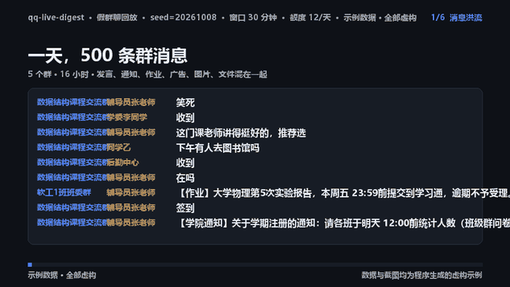

# 26 秒演示片段：它是怎么来的



画面里**没有一个真实群号、昵称或消息**——输入是 `qq_live_digest/simulator.py` 生成的虚构群聊，
每一帧还盖着「示例数据 · 全部虚构」的水印。所以这条片子可以直接进 README、Release、Issue 或
任何公开场合，不需要打码。

## 片子在讲什么

| 时间 | 画面 | 想说明的事 |
| --- | --- | --- |
| 0–3.6 秒 | 消息洪流 | 一天 500 条：发言、通知、作业、广告、图片、文件混在一起 |
| 3.6–8 秒 | 本地先筛 | 377 条被判「不值得打扰」：降噪发生在本地，不是把 500 条都丢给模型 |
| 8–12 秒 | 合并推送 | 漏斗：过滤 + 去重后剩 68 条要点，最后只打扰你 23 次 |
| 12–18 秒 | 一条通知 | 手机上的这条通知：标题、要点、截止时间都是刚跑出来的，不是截图 |
| 18–22.5 秒 | 决策日志 | 每条消息为什么推 / 没推都能查：`main.py decisions --msg-id …` |
| 22.5–26 秒 | 落版 | 复现命令，以及「示例数据 · 全部虚构」声明 |

## 怎么重新生成

```powershell
python tools/make_demo.py                 # 生成 docs/demo/demo.gif
python tools/make_demo.py --mp4           # 顺便导出 mp4（需要 ffmpeg）
python tools/make_demo.py --count 800 --budget 0 --scale 1.0 --fps 8   # 想要更清晰的一版
```

产物与体积参考：

| 文件 | 参数 | 体积 |
| --- | --- | --- |
| `docs/demo/demo.gif` | 26 秒 / 5 fps / 634×357 | 约 3.9 MB |
| `docs/demo/demo.mp4` | 26 秒 / 5 fps / H.264 | 约 0.5 MB |

## 为什么是「生成」而不是「录屏」

录屏会过期：改了判定规则、换了阈值，视频还是老样子，越看越不可信。这里改成让代码渲染，
片子里出现的**每个数字都取自那一次真实回放**（走的是生产同一条链路：入库 → 判定 → 去重 →
摘要 → 投递 → 决策日志）。改了参数或逻辑，重新跑一次 `tools/make_demo.py` 片子就跟着变。

想看数字是怎么算出来的、或者拿同一批数据做别的实验：

```powershell
python main.py simulate --count 500            # 控制台里直接看漏斗
python main.py simulate --out events.jsonl --write-only   # 导出 fixture 反复回放
```

## 已知限制

- 默认离线跑（大模型关闭，回退本地规则），所以片子里展示的是**规则判定 + 本地摘要**的效果；
  接上大模型后摘要会更口语化，数字不变。
- GIF 为了体积压到 5 fps、48 色调色板；要更顺滑请用 `--fps 8 --colors 128`，体积约 5–6 MB。
- 字体优先用系统里的微软雅黑；Linux/macOS 上会自动找 Noto Sans CJK / PingFang，
  也可以用 `QQ_DIGEST_DEMO_FONT` 指定。
